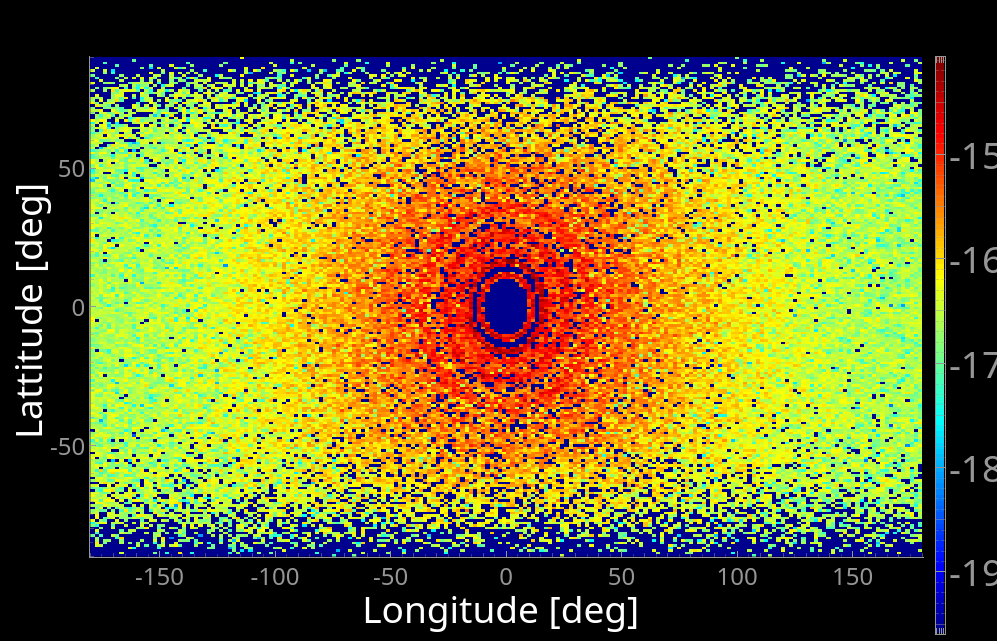

# Day 3 — Thursday 24 September (Morning): AI Image processing

*PaNRAID School, Day 4 morning — deconvolution, denoising, segmentation*

In this exercise, we aim to process some "measurement" data.

AI Processing: `Measurement` -> [ AI ] -> better `Measurement`

We process the simulated images from a simple powder diffractometer model to:
- deconvolve the instrument response by learning the difference between low and high resolution datasets.
- denoise detector images by learning how the noise evolves.
- segment areas in the detector image.

## Baseline

We here use a simple powder diffractometer beam-line. the idea is to generate some detector images and learn some data processing methodologies. We use the `Test_PowderN` model. A similar neutron instrument exists. 

A single powder diffraction simulation step can be launched with e.g.:
```
mxrun --mpi=auto Test_PowderN.instr E0=15
```
or using the GUI.

Plot the powder diffraction image, showing Debye-Scherrer rings. The command to use is e.g. `mxplot /path/to/Test_PowderN_20260919_205540` or using the Plot button in the GUI.



The detector image is produced in `Sphere.dat` which has a content such as:
```
# Format: McCode with text headers
# URL: http://www.mccode.org
# Creator: McXtrace 3.8.4 - Sep. 11, 2026
# Instrument: Test_PowderN.instr
# Ncount: 1000000
# Trace: no
# Gravitation: no
# Seed: 1789844140493954
# Directory: /home/farhi/Test_PowderN/Test_PowderN_20260919_205540
# Param: E0=15
# Param: L1=10
# Param: directbeam=0
# Param: reflections=LaB6_660b_AVID2.hkl
# Param: SPLITS=1
# Param: frac_c=0.8
# Param: frac_i=0.1
# Param: frac_t=0.1
# Param: d_phi=0
# Param: TTH=0
# Param: index=1
# Date: Sat Sep 19 20:55:40 2026 (1789844140)
# type: array_2d(200, 200)
# Source: Test_PowderN (Test_PowderN.instr)
# component: Sph_mon
# position: 0 0 10
# title: 4PI PSD monitor
# Ncount: 1000000
# filename: Sphere.dat
# statistics: X0=0.193266; dX=56.736; Y0=0.0735374; dY=32.1555;
# signal: Min=0; Max=8.57222e-15; Mean=1.56822e-16;
# values: 6.27288e-12 4.56009e-14 90062
# xvar: Lo
# yvar: La
# xlabel: Longitude [deg]
# ylabel: Lattitude [deg]
# zvar: I
# zlabel: Signal per bin
# xylimits: -180 180 -90 90
# variables: I I_err N
# Data [Sph_mon/Sphere.dat] I:
... an array ...
# Errors [Sph_mon/Sphere.dat] I_err:
... an array ...
# Events [Sph_mon/Sphere.dat] N:
... an array ...
```

What is useful for the AI is to get the detector image, as `Data [...] I:`.

You may extract such data with script:
```python
def load_psd_file(filepath):
    """Load a Sphere.dat file and return as a 2D numpy array."""
    with open(filepath, 'r') as f:
        content = f.read()
    data_start = content.find('# Data [') + len('# Data [')
    data_start = content.find('] I:', data_start) + len('] I:')
    data_end = content.find('# Errors [')
    data_str = content[data_start:data_end].strip()
    data = np.fromstring(data_str, sep=' ')
    return data.reshape((200, 200))  # Assuming 200x200
    
# Example usage:
data = load_psd_file("Sphere.dat")
```

--------------------------------------------------------------------------------
## A: Deconvolution (Super-Resolution)

**Aim**: Train a model to convert low-resolution SAXS images (default config) → high-resolution (improved config). We use a Supervised U-Net trained on pairs.

In order to control the resolution, add an `dE` input parameter in the `DEFINE INSTRUMENT Test_PowderN(...)` line, with default value 1 keV.

First generate a low-resolution set of detector images, and a high resolution set with e.g.
```
# Default config (low resolution)
mxrun -d low-res --mpi=auto Test_PowderN.instr -N 11 E0=10,19

# Improved config (high resolution)
mxrun -d high-res --mpi=auto Test_PowderN.instr -N 11 E0=10,19 dE=0.1
```

Then we can grab the results and generate the `X`and `Y` AI datasets, e.g. 
- Load all `Sphere.dat` files from `low-res/` and `high-res/`.
- Pair them by subdirectory index (e.g., `low-res/0/Sphere.dat` ↔ `high-res/0/Sphere.dat`).
- Convert them into normalized 2D numpy arrays for training.

Ask an AI to write such a data pre-processing script. It should actually extract:
```python
X_train, y_train = load_paired_data()
```

Then ask the AI to train a **U-Net** model with pytorch. 
The U-Net Architecture is an Encoder-decoder with skip connections.
It should define a class `class UNet(nn.Module)` with an `__init__` and `forward` methods. 
The data should better be converted to log-scale and normalised to be properly handled.

Train the U-Net, and save the model, e.g.
```
model = UNet()
for epoch in range(100):
    model.train()
    ...
```

Now generate a new data set, e.g. with a different incident energy and resolution... and deconvolve it with the model, e.g.:
```
deconvolved = deconvolve_psd("new_low_res/Sphere.dat")
```

This is also a way to retain small signals.
To get a model less dependant on the beam-line parameters, an image in Q-space is preferred.

--------------------------------------------------------------------------------
## B: Denoising (Noise2Noise)

We may use the **noise2noise** method to train the same U-Net to remove simulation noise. 
This is an unsupervised method that does not require clean data.

First, run the powder diffractometer model with varying `ncount` and `seed`:
```
# Generate 100 noisy versions of SAMPLE=0 with varying NCOUNT and SEED
for i in {1..100}; do
  NCOUNT=$((10000 + i * 100))  # Vary NCOUNT
  SEED=$((1000 + i))           # Vary SEED
  mxrun --ncount $NCOUNT -s $SEED -d low-res/seed_${SEED}_ncount_${NCOUNT} --mpi=auto Test_PowderN.instr E0=15
done
```

The _noise2noise_ method requires to _pair_ `Sphere.dat` files from different NCOUNT/SEED dirs (noisy data) in order to infer the noise shape. 

Request an AI to import `Sphere.dat` files from directory pairs (e.g. N and N+1), for all directories. 
Convert to log-scale and normalize the data.
Ask the AI to reuse the previous U-Net but train it to map moisy pairs.
Then use it to denoise data.

To get a model less dependant on the beam-line parameters, an image in Q-space is preferred.

This methodology is less efficient that the supervised deconvolution seen in section A, but it works even when no reference/clean data is available.

--------------------------------------------------------------------------------
## C: Segmentation

Segmentation is a method which identifies some areas in an image or volume.
OpenCV and Scikit-learn are two libraries of great use for this purpose.

Request an AI to produce a segmentation algorithm using log-scale intensity, and the Otsu thresholding to remove the lower background.

The methodology is basically a Log-scale adaptive thresholding + morphology analysis:
- Convert to log10 scale (compress dynamic range).
- Apply Otsu’s thresholding (or fixed threshold in log space).
- Clean with morphological operations (opening/closing shapes).
- Optional: Refine edges with Canny or watershed.

