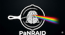

# Photons and Neutrons Realistic Artificial Intelligence Datasets (PaNRAID)

> **DIADEM Academy** — Training course on synthetic data generation for supervised learning  
> 📅 **21–25 September 2026** | 📍 CNRS CAES Village, St-Pierre d'Oléron

## Objective

This course develops an integrated approach to generating synthetic data for supervised learning, combining multi-scale material simulations (DFT, MD, XAS spectroscopy) with comprehensive digital twins of experimental X-ray and neutron facilities — including instrumental effects and experimental artefacts.

## Audience

- Doctoral and post-doctoral students
- Teachers-researchers
- Researchers / research engineers

## Prerequisites

- English proficiency at B2 level (course delivered in English)
- Basic knowledge of X-ray and/or neutron instrumentation
- Familiarity with scientific data processing tools: Python, numerical computation, simulation
- Personal laptop with [McStas](https://mcstas.org/) and [McXtrace](https://mcxtrace.org/) pre-installed

## Programme Overview

| Day | Date | Session | Topic |
|-----|------|---------|-------|
| 1 | Mon 21 Sep | Afternoon | [Introduction](./day1_monday_sep21/) |
| 2 | Tue 22 Sep | Morning | [Neutron and X-ray Sources & Detectors](./day2_tuesday_sep22/morning_sources_detectors/) |
| 2 | Tue 22 Sep | Afternoon | [Optics](./day2_tuesday_sep22/afternoon_optics/) |
| 3 | Wed 23 Sep | Morning | [Diffraction Samples](./day3_wednesday_sep23/morning_diffraction_samples/) |
| 3 | Wed 23 Sep | Afternoon | [Spectroscopy Samples](./day3_wednesday_sep23/afternoon_spectroscopy_samples/) |
| 4 | Thu 24 Sep | Morning | [Imaging Samples](./day4_thursday_sep24/morning_imaging_samples/) |
| 4 | Thu 24 Sep | Afternoon | [AI Applications: Training](./day4_thursday_sep24/afternoon_ai_training/) |
| 5 | Fri 25 Sep | Full day | [AI Applications: Inference](./day5_friday_sep25_ai_inference/) |

## Practical Details

- **Duration:** 5 days — 8 half-days (28 hours total)
- **Modality:** In-person (présentiel)
- **Price:** €700 (includes return shuttle to La Rochelle, 4 nights accommodation, meals 21st evening – 25th midday, bike hire)
- **Optional group outing:** €20 extra

## Trainers

| Name | Affiliation |
|------|-------------|
| **Peter Willendrup** | Senior Research Engineer, DTU Physics / ESS DMSC — McStas lead developer since 2002, McXtrace co-developer since 2009 |
| **Emmanuel Farhi** | Head of Data Reduction and Analysis, SOLEIL Synchrotron — McStas/McXtrace contributor |
| **José Robledo** | Researcher, CONICET / Balseiro Institute, Argentina — AI & neutron science, ML for neutron data analysis |

## Registration

**Contact:** Elodie ISTE  
📞 05 87 50 23 32  
📧 [diadem-formationcontinuecontact@unilim.fr](mailto:diadem-formationcontinuecontact@unilim.fr)  
🌐 [https://formation.pepr-diadem.fr/les-formations](https://formation.pepr-diadem.fr/les-formations)
