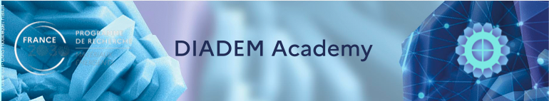
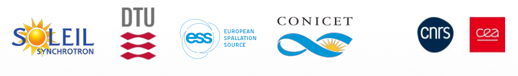

# PaNRAID school materials
### PHOTONS AND NEUTRONS REALISTIC ARTIFICIAL INTELLIGENCE DATASETS
## TIME/VENUE:
21–25 September 2026, CNRS CAES Village (St-Pierre d’Oléron)
## OBJECTIVE:
This course aims to develop an integrated approach to generating synthetic data for supervised learning,
based on the combination of multi-scale material simulations (DFT, MD, XAS spectroscopy) and
comprehensive digital twins of experimental X-ray and neutron facilities, including instrumental effects and
experimental artefacts.
## AUDIENCE:
This training course is intended for:
* Doctoral
* Post-doctoral students
* Teachers-research
* Researchers / research engineers
## PREREQUISITES:
* English proficiency at B2 level (the training is delivered in English
* Basic knowledge of X-ray and/or neutron instrumentation is desirable, as well as of scientific data
processing tools: numerical computation (Python, etc.) / simulation
* Personal laptop for practical sessions with software pre-installed McStas [https://mcstas.org/] and
McXtrace [https://mcxtrace.org/].

