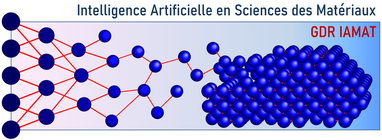

# Photons and Neutrons Realistic Artificial Intelligence Datasets (PaNRAID)

> **DIADEM Academy** — Training course on synthetic data generation for supervised learning  
> 📅 **21–25 September 2026** | 📍 [CNRS CAES Village, St-Pierre d'Oléron](https://cartes.app/?allez=CAES+du+CNRS+La+Vieille+Perrotine%7Cn7785468780%7C-1.25013%7C45.95235)

## Objective

This course develops an integrated approach to generating synthetic data for supervised learning, combining multi-scale material simulations (DFT, MD, XAS spectroscopy) with comprehensive digital twins of experimental X-ray and neutron facilities — including instrumental effects and experimental artefacts.

See [`Data_Generation_Pipeline.md`](./Data_Generation_Pipeline.md) for how a single McStas/McXtrace simulation run, made throughout Days 2–3, becomes one labelled record in a Day 4/5 training dataset — the explicit bridge between the instrument-side and AI-side halves of the programme below.

## Audience

- Doctoral and post-doctoral students
- Teachers-researchers
- Researchers / research engineers

## Prerequisites

- English proficiency at B2 level (course delivered in English)
- Basic knowledge of X-ray and/or neutron instrumentation
- Familiarity with scientific data processing tools: Python, numerical computation, simulation
- Personal laptop with [McStas](https://mcstas.org/) and [McXtrace](https://mcxtrace.org/) pre-installed, at best via [these instructions](Software).

## Programme Overview

| Day | Date | Session | Topic |
|-----|------|---------|-------|
| 1 | Mon 21 Sep | 14:00-17:00 | **[Introduction](./21_September_Monday/)** |
|   |            | lecture     | [21>01 Seeking for AI (PDF slides)](./21_September_Monday/01_Seeking_for_AI/01_Seeking_for_AI.pdf) [(pptx)](./21_September_Monday/01_Seeking_for_AI/01_Seeking_for_AI.pptx) |
|   |            | lecture     | [21>02 Intro and General Concepts (PDF slides)](./21_September_Monday/02_Intro_and_General_Concepts/02_McStas_McXtrace_Common_Introduction.pdf) [(pptx)](./21_September_Monday/02_Intro_and_General_Concepts/02_McStas_McXtrace_Common_Introduction.pptx) | 
|   |            |                 | [21>02.1 vibe-code examples (PDF)](21_September_Monday/02_Intro_and_General_Concepts/Vibe/Vibing.pdf) [(pptx)](21_September_Monday/02_Intro_and_General_Concepts/Vibe/Vibing.pptx)|
|   |            | lecture     | [21>03 Into Deep Learning (PDF slides)](./21_September_Monday/03_intro_deep_learning/03_robledo_intro_DL.pdf) |
| 2 | Tue 22 Sep | 09:00-12:00 | **[Sources, Detectors & Optics](./22_September_Tuesday/04_morning_sources_detectors/)** |
|   |            | lecture     | [22>04 Sources and Monitors (PDF slides)](./22_September_Tuesday/04_morning_sources_detectors/Sources_Monitors/McStas_McXtrace_Sources_and_Monitors.pdf) [(pptx)](./22_September_Tuesday/04_morning_sources_detectors/Sources_Monitors/McStas_McXtrace_Sources_and_Monitors.pptx) |
|   |            | lecture     | [22>04 Optics (PDF slides)](./22_September_Tuesday/04_morning_sources_detectors/Optics/McStas_McXtrace_Optics.pdf) [(pptx)](./22_September_Tuesday/04_morning_sources_detectors/Optics/McStas_McXtrace_Optics.pptx) |
|   |            | practicals  | [22>04 Sources and Monitors](./22_September_Tuesday/04_morning_sources_detectors/Sources_Monitors/Exercises_Sources_and_Monitors.md) |
|   |            | practicals  | [22>04 Optics](./22_September_Tuesday/04_morning_sources_detectors/Optics/Exercises_Optics.md) |
| 2 | Tue 22 Sep | 14:00-17:00 | [22>05 Data generation for ML/AI - setting the scene](./22_September_Tuesday/05_afternoon_data_generation/README.md)
| 3 | Wed 23 Sep | 09:00-12:00 | **[Samples 1: Diffraction and Imaging](./23_September_Wednesday/06_morning_samples_1/)** |
|   |            | lecture     | [23>06 Samples (PDF slides)](./23_September_Wednesday/McStas_McXtrace_Sample_Components.pdf) [(pptx)](./23_September_Wednesday/McStas_McXtrace_Sample_Components.pptx)|
|   |            | practicals  | [23>06 Samples: Powder Diffraction](./23_September_Wednesday/06_morning_samples_1/Exercises_PowderN.md) |
|   |            | practicals  | [23>06 Samples: Imaging](./23_September_Wednesday/06_morning_samples_1/Batteries/README.md) |
| 3 | Wed 23 Sep | 14:00-17:00 | **[Samples 2: X-ray Spectroscopy and SANS](./23_September_Wednesday/07_afternoon_samples_2/)** |
|   |            | practicals  | [23>07 Samples: Absorption](./23_September_Wednesday/07_afternoon_samples_2/Spectroscopy_abs/README.md) |
|   |            | practicals  | [23>07 Samples: Fluorescence](./23_September_Wednesday/07_afternoon_samples_2/Spectroscopy_fluo/README.md) |
|   |            | practicals  | [23>07 Samples: SANS -> AI](./23_September_Wednesday/07_afternoon_samples_2/SANS/README.md) |
| 4 | Thu 24 Sep | 09:00-12:00 | **[AI Applications 1](./24_September_Thursday/)** |
|   |            | practical   | [Optimisation](./24_September_Thursday/08_morning_ai_optimise) |
|   |            | practical   | De-noising/de-convolution/segmentation |
|   |            | practical   | Surrogate  (approximator) |
| 4 | Thu 24 Sep | 14:00-17:00 | **[AI Applications 2](./24_September_Thursday/)** |
|   |            | practical   | Inverse problems: classification/regression |
|   |            | excursion   | Fort Boyard |
| 5 | Fri 25 Sep | morning  | [AI Applications: Inference](./25_September_Friday) |

## Practical Details

- **Duration:** 5 days — 8 half-days (28 hours total)
- **Modality:** In-person (présentiel)
- **Price:** €700 which includes return shuttle to La Rochelle, 4 nights accommodation, meals 21st evening – 25th midday, bike hire, group outing at Fort Boyard.

## Trainers

| Name | Affiliation |
|------|-------------|
| **Peter Willendrup** | Senior Research Engineer, DTU Physics / ESS DMSC — McStas lead developer since 2002, McXtrace co-developer since 2009 |
| **Emmanuel Farhi** | Head of Data Reduction and Analysis, SOLEIL Synchrotron — McStas/McXtrace contributor |
| **José Robledo** | Researcher, CONICET / Balseiro Institute, Argentina — AI & neutron science, ML for neutron data analysis |

## Registration

**Contact:** Elodie ISTE  
📞 05 87 50 23 32  
📧 [diadem-formationcontinuecontact@unilim.fr](mailto:diadem-formationcontinuecontact@unilim.fr)  
🌐 [https://formation.pepr-diadem.fr/les-formations](https://formation.pepr-diadem.fr/les-formations)

This school receives moral support from [GDR 2123 IAMAT](https://iamat.cnrs.fr/) 
